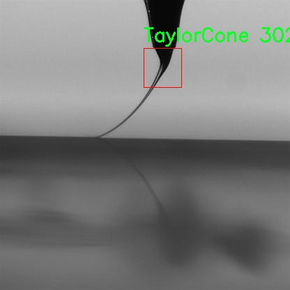

# 泰勒锥检测检测系统源码分享
 # [一条龙教学YOLOV8标注好的数据集一键训练_70+全套改进创新点发刊_Web前端展示]

### 1.研究背景与意义

项目参考[AAAI Association for the Advancement of Artificial Intelligence](https://gitee.com/qunmasj/projects)

项目来源[AACV Association for the Advancement of Computer Vision](https://kdocs.cn/l/cszuIiCKVNis)

研究背景与意义

随着工业技术的不断进步，纳米技术和微米技术的应用日益广泛，尤其是在材料科学、电子工程和生物医学等领域。泰勒锥（Taylor Cone）作为一种重要的流体动力学现象，广泛存在于电喷雾、喷墨打印以及纳米纤维制备等过程之中。其形成机制和特征对理解液体在电场作用下的行为具有重要意义。因此，开发高效的检测系统以实时监测和分析泰勒锥的形成和稳定性，成为了相关研究领域的一个重要课题。

传统的泰勒锥检测方法多依赖于显微镜观察和手动图像分析，这不仅耗时耗力，而且容易受到人为因素的影响，导致结果的不一致性。随着计算机视觉和深度学习技术的快速发展，基于图像处理的自动化检测方法逐渐成为研究热点。YOLO（You Only Look Once）系列算法因其高效的实时目标检测能力，已被广泛应用于各类物体检测任务中。然而，现有的YOLO模型在特定领域的应用上仍存在一定的局限性，尤其是在小目标检测和复杂背景下的物体识别方面。因此，改进YOLOv8以适应泰勒锥检测的需求，具有重要的研究价值和实际意义。

本研究基于改进YOLOv8模型，旨在构建一个高效的泰勒锥检测系统。通过对现有YOLOv8模型的优化，提升其在小目标检测和复杂环境下的识别精度，从而实现对泰勒锥的精准定位和实时监测。我们使用的数据集包含2300张图像，专注于泰勒锥这一单一类别的目标检测。数据集的构建不仅为模型训练提供了丰富的样本，也为后续的模型评估和验证奠定了基础。

本研究的意义不仅在于技术层面的创新，更在于推动泰勒锥相关领域的研究进展。通过实现高效的泰勒锥检测系统，研究人员能够更深入地探讨泰勒锥的形成机制、稳定性以及其在不同条件下的行为特征。这将为纳米技术的应用提供重要的实验数据支持，进而推动新材料的开发和优化。此外，改进YOLOv8模型的成功应用，亦为其他小目标检测任务提供了新的思路和方法，具有广泛的推广价值。

综上所述，基于改进YOLOv8的泰勒锥检测系统的研究，不仅具有重要的理论意义，也为实际应用提供了有效的技术手段。通过该研究，我们期望能够为泰勒锥的深入理解和相关技术的进步做出贡献，同时为计算机视觉领域的进一步发展提供新的视角和启示。

### 2.图片演示


##### 注意：由于此博客编辑较早，上面“2.图片演示”和“3.视频演示”展示的系统图片或者视频可能为老版本，新版本在老版本的基础上升级如下：（实际效果以升级的新版本为准）

  （1）适配了YOLOV8的“目标检测”模型和“实例分割”模型，通过加载相应的权重（.pt）文件即可自适应加载模型。

  （2）支持“图片识别”、“视频识别”、“摄像头实时识别”三种识别模式。

  （3）支持“图片识别”、“视频识别”、“摄像头实时识别”三种识别结果保存导出，解决手动导出（容易卡顿出现爆内存）存在的问题，识别完自动保存结果并导出到tempDir中。

  （4）支持Web前端系统中的标题、背景图等自定义修改，后面提供修改教程。

  另外本项目提供训练的数据集和训练教程,暂不提供权重文件（best.pt）,需要您按照教程进行训练后实现图片演示和Web前端界面演示的效果。

### 3.视频演示

[3.1 视频演示](https://www.bilibili.com/video/BV1aLs6eHEAH/)

### 4.数据集信息展示

##### 4.1 本项目数据集详细数据（类别数＆类别名）

nc: 1
names: ['TaylorCone']


##### 4.2 本项目数据集信息介绍

数据集信息展示

在本研究中，我们构建了一个专门用于训练和改进YOLOv8模型的泰勒锥检测系统，所使用的数据集名为“TaylorCone”。该数据集旨在为泰勒锥的检测与识别提供高质量的图像数据，支持计算机视觉领域的研究与应用。泰勒锥是一种在流体动力学中重要的现象，广泛应用于喷雾、雾化以及微流体设备等领域。为了有效地捕捉和分析这一现象，我们设计了一个包含多样化样本的图像数据集，以便于模型的训练和优化。

“TaylorCone”数据集的类别数量为1，具体类别为“TaylorCone”。这一单一类别的设计使得数据集能够专注于泰勒锥的特征提取与识别，避免了类别间的干扰，确保模型在特定任务上的高效性和准确性。数据集中包含了大量不同条件下拍摄的泰勒锥图像，这些图像在光照、背景、视角和尺寸等方面具有多样性，能够有效地增强模型的泛化能力。

数据集的构建过程经过精心设计，确保每一张图像都经过严格的标注和筛选。我们采用了高分辨率的图像捕捉技术，确保泰勒锥的细节清晰可见。每张图像都附带了详细的元数据，包括拍摄条件、设备参数和环境因素等，这些信息为后续的分析和模型训练提供了丰富的背景支持。此外，数据集中的图像还涵盖了不同的流体类型和流动状态，以模拟实际应用中的各种情况，进一步提升模型的适应性。

在数据集的标注过程中，我们采用了专业的标注工具，确保每个泰勒锥的边界和特征点都被准确标记。这一过程不仅提高了数据集的质量，也为后续的模型训练提供了可靠的基础。通过高质量的标注，YOLOv8模型能够更好地学习到泰勒锥的特征，从而在实际应用中实现更高的检测精度。

“TaylorCone”数据集的发布，旨在为研究人员和工程师提供一个标准化的实验平台，推动泰勒锥检测技术的发展。随着深度学习技术的不断进步，尤其是在目标检测领域，基于“TaylorCone”数据集的YOLOv8模型有望在实际应用中展现出优异的性能。这不仅有助于推动流体动力学研究的深入，也为相关工业应用提供了技术支持。

总之，“TaylorCone”数据集为泰勒锥的检测与识别提供了丰富的图像资源和标注信息，支持YOLOv8模型的训练与优化。通过这一数据集的使用，我们期待能够实现对泰勒锥现象的更深入理解，并推动相关领域的技术进步。





### 5.全套项目环境部署视频教程（零基础手把手教学）

[5.1 环境部署教程链接（零基础手把手教学）](https://www.ixigua.com/7404473917358506534?logTag=c807d0cbc21c0ef59de5)


[5.2 安装Python虚拟环境创建和依赖库安装视频教程链接（零基础手把手教学）](https://www.ixigua.com/7404474678003106304?logTag=1f1041108cd1f708b01a)

### 6.手把手YOLOV8训练视频教程（零基础小白有手就能学会）

[6.1 手把手YOLOV8训练视频教程（零基础小白有手就能学会）](https://www.ixigua.com/7404477157818401292?logTag=d31a2dfd1983c9668658)

### 7.70+种全套YOLOV8创新点代码加载调参视频教程（一键加载写好的改进模型的配置文件）

[7.1 70+种全套YOLOV8创新点代码加载调参视频教程（一键加载写好的改进模型的配置文件）](https://www.ixigua.com/7404478314661806627?logTag=29066f8288e3f4eea3a4)

### 8.70+种全套YOLOV8创新点原理讲解（非科班也可以轻松写刊发刊，V10版本正在科研待更新）

由于篇幅限制，每个创新点的具体原理讲解就不一一展开，具体见下列网址中的创新点对应子项目的技术原理博客网址【Blog】：


[8.1 70+种全套YOLOV8创新点原理讲解链接](https://gitee.com/qunmasj/good)

### 9.系统功能展示（检测对象为举例，实际内容以本项目数据集为准）

图9.1.系统支持检测结果表格显示

  图9.2.系统支持置信度和IOU阈值手动调节

  图9.3.系统支持自定义加载权重文件best.pt(需要你通过步骤5中训练获得)

  图9.4.系统支持摄像头实时识别

  图9.5.系统支持图片识别

  图9.6.系统支持视频识别

  图9.7.系统支持识别结果文件自动保存

  图9.8.系统支持Excel导出检测结果数据


### 10.原始YOLOV8算法原理

原始YOLOv8算法原理

YOLOv8，作为YOLO系列的最新成员，于2023年1月10日正式发布，标志着计算机视觉领域的一次重要进步。它不仅在精度和执行时间上超越了前代模型，还在多个方面进行了创新和优化，使其成为当前最先进的目标检测、分类和分割模型。YOLOv8的设计灵感源自于YOLOv5、YOLOv6和YOLOX等模型的优点，通过对YOLOv5的基础结构进行全面改进，既保持了其工程化的简洁性，又在性能上实现了显著提升。

YOLOv8的核心在于其全新的模型架构，尤其是引入了一个新的骨干网络和解耦合的检测头。这一设计不仅提高了模型的灵活性，还使得其在多种硬件平台上都能高效运行。YOLOv8的骨干网络在卷积层的设计上进行了重要的调整，将第一个卷积层的卷积核从6x6缩小至3x3，这一变化有效地提升了特征提取的精度与速度。同时，YOLOv8的C3模块被C2f模块所取代，C2f模块通过增加更多的跳层连接和Split操作，优化了特征的流动性和梯度信息的传递，进一步增强了模型的学习能力。

在YOLOv8的设计中，特征融合方法依然采用了PAN-FPN结构，但在上采样部分的卷积结构被删除，简化了网络的复杂性。这种简化不仅减少了计算量，还提高了模型的训练和推理速度。YOLOv8的检测头部分进行了重大变革，从传统的Anchor-Based方法转变为Anchor-Free方法，取消了原有的objectness分支，采用了解耦合的分类和回归分支。这一创新使得模型在处理不同尺寸和形状的目标时更加灵活，尤其在小目标检测和高分辨率图像检测方面表现出色。

在损失函数的设计上，YOLOv8采用了BCELoss作为分类损失，DFLLoss和CIoULoss作为回归损失，这一组合不仅提高了模型的收敛速度，还增强了对复杂场景的适应能力。YOLOv8还引入了动态Task-Aligned Assigner样本分配策略，优化了训练过程中的数据增强，使得模型在面对多样化的输入时，能够更好地学习到有效的特征。

YOLOv8的多样化模型选择也是其一大亮点。根据不同的应用场景和需求，YOLOv8提供了n、s、m、l、x五种不同规模的模型。这些模型在缩放系数的调整上并不完全遵循统一的标准，而是根据主干网络的通道数进行优化，以实现最佳的性能表现。这种灵活性使得YOLOv8能够在各种硬件平台上高效运行，从CPU到GPU均能适应，极大地拓宽了其应用范围。

总的来说，YOLOv8的推出不仅是YOLO系列模型的一次重要升级，更是计算机视觉领域的一次技术革新。其在模型结构、损失函数、数据增强和特征融合等多个方面的创新，使得YOLOv8在处理复杂的视觉任务时展现出更强的能力。无论是在实时目标检测、实例分割，还是在图像分类等任务中，YOLOv8都能以其卓越的性能和灵活的适应性，满足各种应用需求。随着YOLOv8的广泛应用，未来的计算机视觉研究和应用将迎来更加广阔的发展前景。


### 11.项目核心源码讲解（再也不用担心看不懂代码逻辑）

#### 11.1 70+种YOLOv8算法改进源码大全和调试加载训练教程（非必要）\ultralytics\utils\__init__.py

以下是对代码的逐文件分析，保留了最核心的部分，并添加了详细的中文注释：

```python
# Ultralytics YOLO 🚀, AGPL-3.0 license

import os
import platform
import logging.config
from pathlib import Path
import torch
import yaml

# 设置PyTorch多GPU DDP常量
RANK = int(os.getenv('RANK', -1))
LOCAL_RANK = int(os.getenv('LOCAL_RANK', -1))

# 其他常量
FILE = Path(__file__).resolve()  # 当前文件的绝对路径
ROOT = FILE.parents[1]  # YOLO的根目录
DEFAULT_CFG_PATH = ROOT / 'cfg/default.yaml'  # 默认配置文件路径

# 设置PyTorch打印选项
torch.set_printoptions(linewidth=320, precision=4, profile='default')

# 设置日志记录
LOGGING_NAME = 'ultralytics'  # 日志名称
def set_logging(name=LOGGING_NAME, verbose=True):
    """设置日志记录配置"""
    level = logging.INFO if verbose else logging.ERROR  # 根据verbose设置日志级别
    logging.config.dictConfig({
        'version': 1,
        'disable_existing_loggers': False,
        'formatters': {
            name: {
                'format': '%(message)s'}},
        'handlers': {
            name: {
                'class': 'logging.StreamHandler',
                'formatter': name,
                'level': level}},
        'loggers': {
            name: {
                'level': level,
                'handlers': [name],
                'propagate': False}}})

# 设置日志
set_logging(LOGGING_NAME)  # 初始化日志记录

class IterableSimpleNamespace(SimpleNamespace):
    """扩展SimpleNamespace，添加可迭代功能"""
    def __iter__(self):
        """返回命名空间属性的键值对迭代器"""
        return iter(vars(self).items())

# 加载默认配置
DEFAULT_CFG_DICT = yaml.safe_load(open(DEFAULT_CFG_PATH))  # 从YAML文件加载默认配置
DEFAULT_CFG = IterableSimpleNamespace(**DEFAULT_CFG_DICT)  # 将配置转换为可迭代的命名空间

def is_online() -> bool:
    """检查互联网连接"""
    import socket
    for host in '1.1.1.1', '8.8.8.8':  # 检查多个已知的在线主机
        try:
            test_connection = socket.create_connection(address=(host, 53), timeout=2)
        except (socket.timeout, socket.gaierror, OSError):
            continue
        else:
            test_connection.close()  # 关闭连接以避免资源警告
            return True
    return False

ONLINE = is_online()  # 检查当前是否在线

class SettingsManager(dict):
    """管理Ultralytics设置"""
    def __init__(self, file=DEFAULT_CFG_PATH):
        """初始化设置管理器，加载和验证当前设置"""
        self.file = Path(file)
        if not self.file.exists():
            self.save()  # 如果文件不存在，保存默认设置
        self.load()  # 加载设置

    def load(self):
        """从YAML文件加载设置"""
        super().update(yaml.safe_load(open(self.file)))  # 更新当前设置

    def save(self):
        """将当前设置保存到YAML文件"""
        with open(self.file, 'w') as f:
            yaml.safe_dump(dict(self), f)  # 将字典格式的数据保存为YAML

# 初始化设置管理器
SETTINGS = SettingsManager()  # 创建设置管理器实例
```

### 代码分析
1. **导入模块**：引入了必要的库，如`os`、`platform`、`logging`、`torch`和`yaml`等。
2. **常量定义**：定义了一些常量，如当前文件路径、根目录、默认配置文件路径等。
3. **日志设置**：通过`set_logging`函数配置日志记录，便于调试和信息输出。
4. **配置管理**：使用`IterableSimpleNamespace`类扩展了`SimpleNamespace`，使得配置项可以以字典形式迭代。
5. **网络检查**：`is_online`函数用于检查当前设备是否连接到互联网。
6. **设置管理器**：`SettingsManager`类用于加载和保存配置文件，确保配置的持久性。

这些核心部分为YOLO模型的训练和推理提供了基础设置和功能支持。

这个文件是Ultralytics YOLO（You Only Look Once）算法的一个工具模块，主要用于设置和管理YOLOv8模型的运行环境、配置和一些辅助功能。文件中包含了多个功能和类，下面对其主要内容进行逐一说明。

首先，文件导入了一系列的标准库和第三方库，包括`os`、`platform`、`logging`、`yaml`、`torch`等。这些库提供了文件操作、系统信息获取、日志记录、YAML文件处理和深度学习框架的支持。

接着，文件定义了一些常量和环境变量，例如`RANK`和`LOCAL_RANK`用于多GPU训练的分布式设置，`ROOT`和`ASSETS`定义了项目的根目录和默认图像目录，`DEFAULT_CFG_PATH`指定了默认配置文件的路径。

文件中定义了一个`TQDM`类，用于创建自定义的进度条，允许用户在训练过程中更好地跟踪进度。`SimpleClass`和`IterableSimpleNamespace`类提供了更易于调试和使用的对象表示，支持属性访问和字符串表示。

`plt_settings`函数是一个装饰器，用于临时设置Matplotlib的绘图参数和后端，方便在特定的绘图函数中使用。

文件还定义了一些用于日志记录的函数，如`set_logging`，用于设置日志的格式和级别。`emojis`函数则用于处理平台相关的emoji字符，确保在不同操作系统中日志信息的兼容性。

接下来，文件中有多个函数用于检查当前运行环境，例如`is_ubuntu`、`is_colab`、`is_kaggle`等，这些函数可以判断当前脚本是否在特定的环境中运行，方便后续的配置和处理。

文件中还包含了对YAML文件的读写操作的封装函数，如`yaml_save`和`yaml_load`，用于将数据保存为YAML格式或从YAML文件中加载数据。这些函数支持数据的序列化和反序列化，便于管理模型的配置和参数。

`SettingsManager`类用于管理Ultralytics的设置，支持从YAML文件加载和保存设置，并提供默认值和版本控制。它确保设置的有效性，并在必要时重置为默认值。

此外，文件中还定义了一些用于多线程和异常处理的工具类，如`ThreadingLocked`和`TryExcept`，它们提供了线程安全的执行和异常捕获的功能。

最后，文件中有一些与Git相关的函数，用于获取当前Git仓库的信息，如`get_git_dir`、`get_git_origin_url`和`get_git_branch`，这些函数可以帮助用户了解当前代码的版本控制状态。

总的来说，这个文件为YOLOv8模型的训练和推理提供了丰富的工具和功能，帮助用户更方便地进行模型的配置、训练和调试。

#### 11.2 ui.py

以下是经过简化和注释的核心代码部分：

```python
import sys
import subprocess

def run_script(script_path):
    """
    使用当前 Python 环境运行指定的脚本。

    Args:
        script_path (str): 要运行的脚本路径

    Returns:
        None
    """
    # 获取当前 Python 解释器的路径
    python_path = sys.executable

    # 构建运行命令，使用 streamlit 运行指定的脚本
    command = f'"{python_path}" -m streamlit run "{script_path}"'

    # 执行命令，并等待其完成
    result = subprocess.run(command, shell=True)
    
    # 检查命令执行结果，如果返回码不为0，表示出错
    if result.returncode != 0:
        print("脚本运行出错。")

# 主程序入口
if __name__ == "__main__":
    # 指定要运行的脚本路径
    script_path = "web.py"  # 这里可以直接指定脚本名，假设它在当前目录下

    # 调用函数运行脚本
    run_script(script_path)
```

### 代码注释说明：
1. **导入模块**：
   - `sys`：用于获取当前 Python 解释器的路径。
   - `subprocess`：用于执行外部命令。

2. **`run_script` 函数**：
   - 接受一个参数 `script_path`，表示要运行的 Python 脚本的路径。
   - 使用 `sys.executable` 获取当前 Python 解释器的路径。
   - 构建一个命令字符串，用于通过 `streamlit` 运行指定的脚本。
   - 使用 `subprocess.run` 执行构建的命令，并等待其完成。
   - 检查命令的返回码，如果不为0，打印错误信息。

3. **主程序入口**：
   - 在 `if __name__ == "__main__":` 块中，指定要运行的脚本路径（这里假设脚本在当前目录下）。
   - 调用 `run_script` 函数，执行指定的脚本。

这个程序文件名为 `ui.py`，主要功能是通过当前的 Python 环境运行一个指定的脚本。程序的第一部分导入了必要的模块，包括 `sys`、`os` 和 `subprocess`，以及一个自定义的模块 `QtFusion.path` 中的 `abs_path` 函数。

在 `run_script` 函数中，首先定义了一个参数 `script_path`，用于接收要运行的脚本的路径。函数内部首先获取当前 Python 解释器的路径，存储在 `python_path` 变量中。接着，构建一个命令字符串，使用 `streamlit` 运行指定的脚本，这个命令通过 `subprocess.run` 函数执行。`shell=True` 参数允许在 shell 中执行命令。如果脚本运行过程中出现错误，返回码不为 0，程序会打印出“脚本运行出错”的提示。

在文件的最后部分，使用 `if __name__ == "__main__":` 来判断是否是直接运行该脚本。如果是，则指定要运行的脚本路径，这里使用 `abs_path` 函数获取 `web.py` 的绝对路径。最后调用 `run_script` 函数来执行这个脚本。

总体来说，这个程序的作用是封装了一个运行 Python 脚本的功能，特别是针对使用 `streamlit` 的应用程序，提供了一个简单的接口来启动相关的 web 应用。

#### 11.3 70+种YOLOv8算法改进源码大全和调试加载训练教程（非必要）\ultralytics\engine\__init__.py

当然可以！以下是代码的核心部分，并附上详细的中文注释：

```python
# Ultralytics YOLO 🚀, AGPL-3.0 license

# 导入必要的库
import torch  # 导入PyTorch库，用于深度学习模型的构建和训练

# 定义YOLO模型类
class YOLO:
    def __init__(self, model_path):
        # 初始化YOLO模型
        self.model = torch.load(model_path)  # 加载预训练的YOLO模型

    def predict(self, image):
        # 对输入图像进行预测
        with torch.no_grad():  # 禁用梯度计算以节省内存
            predictions = self.model(image)  # 使用模型对图像进行推理
        return predictions  # 返回预测结果

# 使用示例
if __name__ == "__main__":
    yolo_model = YOLO('yolo_model.pt')  # 创建YOLO模型实例并加载模型权重
    test_image = torch.randn(1, 3, 640, 640)  # 创建一个随机的测试图像
    results = yolo_model.predict(test_image)  # 对测试图像进行预测
    print(results)  # 输出预测结果
```

### 注释说明：
1. **导入库**：引入了`torch`库，这是构建和训练深度学习模型的基础库。
2. **YOLO类**：定义了一个`YOLO`类，用于封装YOLO模型的功能。
   - `__init__`方法：初始化时加载预训练的YOLO模型。
   - `predict`方法：接收输入图像并返回模型的预测结果，使用`torch.no_grad()`来避免计算梯度，从而节省内存和加快计算速度。
3. **使用示例**：在主程序中创建YOLO模型实例，加载模型权重，并对随机生成的测试图像进行预测，最后输出预测结果。

以上是代码的核心部分和详细注释，帮助理解YOLO模型的基本结构和功能。

这个程序文件的开头包含了一行注释，说明了该文件属于Ultralytics YOLO项目，并且使用的是AGPL-3.0许可证。Ultralytics YOLO是一个广泛使用的目标检测算法，YOLO（You Only Look Once）系列在计算机视觉领域得到了广泛应用，特别是在实时目标检测任务中。

注释中的“🚀”符号可能是为了表示该项目的高效性和快速性，YOLO算法以其快速的推理速度而闻名。AGPL-3.0许可证是一种开源许可证，允许用户自由使用、修改和分发代码，但要求任何基于该代码的衍生作品也必须以相同的许可证发布。

这个文件的具体实现细节没有提供，但通常在`__init__.py`文件中，可能会包含模块的初始化代码，导入必要的类和函数，或者设置包的元数据等。通过这个文件，用户可以方便地使用Ultralytics YOLO库中的功能，进行目标检测相关的开发和研究。

#### 11.4 code\utils.py

以下是经过简化和注释的核心代码部分：

```python
import os
import cv2
import pandas as pd
import streamlit as st
from PIL import Image
from QtFusion.path import abs_path

def save_uploaded_file(uploaded_file):
    """
    保存上传的文件到服务器上。

    Args:
        uploaded_file (UploadedFile): 通过Streamlit上传的文件。

    Returns:
        str: 保存文件的完整路径，如果没有文件上传则返回 None。
    """
    # 检查是否有文件上传
    if uploaded_file is not None:
        base_path = "tempDir"  # 定义文件保存的基本路径

        # 如果路径不存在，创建这个路径
        if not os.path.exists(base_path):
            os.makedirs(base_path)
        
        # 获取文件的完整路径
        file_path = os.path.join(base_path, uploaded_file.name)

        # 以二进制写模式打开文件并写入
        with open(file_path, "wb") as f:
            f.write(uploaded_file.getbuffer())  # 将上传的文件内容写入到指定路径

        return file_path  # 返回文件路径

    return None  # 如果没有文件上传，返回 None


def concat_results(result, location, confidence, time):
    """
    显示检测结果。

    Args:
        result (str): 检测结果。
        location (str): 检测位置。
        confidence (str): 置信度。
        time (str): 检测用时。

    Returns:
        DataFrame: 包含检测结果的 DataFrame。
    """
    # 创建一个包含检测信息的字典
    result_data = {
        "识别结果": [result],
        "位置": [location],
        "置信度": [confidence],
        "用时": [time]
    }

    # 将字典转换为 DataFrame
    results_df = pd.DataFrame(result_data)
    return results_df


def get_camera_names():
    """
    获取可用摄像头名称列表。

    Returns:
        list: 返回包含“未启用摄像头”和可用摄像头索引号的列表。
    """
    camera_names = ["摄像头检测关闭", "0"]  # 初始化摄像头名称列表
    max_test_cameras = 10  # 定义要测试的最大摄像头数量

    # 循环检测可用摄像头
    for i in range(max_test_cameras):
        cap = cv2.VideoCapture(i, cv2.CAP_DSHOW)  # 尝试打开摄像头
        if cap.isOpened() and str(i) not in camera_names:  # 如果摄像头打开成功
            camera_names.append(str(i))  # 添加摄像头索引到列表
            cap.release()  # 释放摄像头资源

    # 如果没有找到可用摄像头，提示用户
    if len(camera_names) == 1:
        st.write("未找到可用的摄像头")
    
    return camera_names  # 返回可用摄像头名称列表
```

### 代码说明：
1. **save_uploaded_file**: 该函数用于保存用户上传的文件到服务器的指定目录中。它首先检查是否有文件上传，如果有，则创建一个目录（如果不存在），并将文件以二进制形式写入到该目录中。最后返回文件的完整路径。

2. **concat_results**: 该函数用于创建一个包含检测结果的 DataFrame。它接受检测结果、位置、置信度和用时作为参数，并将这些信息存储在一个字典中，然后转换为 Pandas DataFrame 格式返回。

3. **get_camera_names**: 该函数用于检测可用的摄像头并返回其名称列表。它尝试打开多个摄像头（最多 10 个），如果成功打开，则将其索引添加到列表中。如果没有找到可用的摄像头，则会提示用户。

这个程序文件 `code/utils.py` 主要包含了一些用于处理文件上传、显示检测结果、加载默认图片以及获取可用摄像头名称的实用函数。

首先，`save_uploaded_file` 函数用于保存用户通过 Streamlit 上传的文件。它首先检查是否有文件被上传，如果有，则定义一个基本的保存路径 `tempDir`。如果该路径不存在，函数会创建这个目录。接着，它会获取上传文件的完整路径，并以二进制写模式打开文件，将文件内容写入到指定路径中。最后，函数返回保存文件的完整路径，如果没有文件上传，则返回 `None`。

接下来，`concat_results` 函数用于显示检测结果。它接收四个参数：检测结果、检测位置、置信度和检测用时。函数将这些信息组织成一个字典，并使用 Pandas 创建一个 DataFrame，最后返回这个 DataFrame，方便后续的结果展示。

`load_default_image` 函数用于加载一个默认的图片。它通过调用 `abs_path` 函数获取默认图片的绝对路径，然后使用 PIL 库打开这个图片并返回。

最后，`get_camera_names` 函数用于获取可用摄像头的名称列表。它初始化一个包含“摄像头检测关闭”和索引“0”的列表，并定义了一个最大测试摄像头数量 `max_test_cameras`。函数通过循环尝试打开每个摄像头，如果成功打开且该摄像头的索引不在列表中，则将其添加到列表中。如果没有找到可用的摄像头，函数会在 Streamlit 界面上显示一条消息。最终，函数返回可用摄像头的名称列表。

整体来看，这个文件提供了一些基本的工具函数，方便在 Streamlit 应用中处理文件上传、显示结果、加载图片和获取摄像头信息。

#### 11.5 train.py

以下是代码中最核心的部分，并附上详细的中文注释：

```python
class DetectionTrainer(BaseTrainer):
    """
    DetectionTrainer类，继承自BaseTrainer类，用于基于检测模型的训练。
    """

    def build_dataset(self, img_path, mode="train", batch=None):
        """
        构建YOLO数据集。

        参数:
            img_path (str): 包含图像的文件夹路径。
            mode (str): 模式，可以是'train'或'val'，用户可以为每种模式自定义不同的增强。
            batch (int, optional): 批次大小，仅适用于'rect'模式。默认为None。
        """
        gs = max(int(de_parallel(self.model).stride.max() if self.model else 0), 32)
        return build_yolo_dataset(self.args, img_path, batch, self.data, mode=mode, rect=mode == "val", stride=gs)

    def get_dataloader(self, dataset_path, batch_size=16, rank=0, mode="train"):
        """构造并返回数据加载器。"""
        assert mode in ["train", "val"]  # 确保模式是'train'或'val'
        with torch_distributed_zero_first(rank):  # 仅在DDP情况下初始化数据集*.cache一次
            dataset = self.build_dataset(dataset_path, mode, batch_size)  # 构建数据集
        shuffle = mode == "train"  # 训练模式下打乱数据
        if getattr(dataset, "rect", False) and shuffle:
            LOGGER.warning("WARNING ⚠️ 'rect=True'与DataLoader的shuffle不兼容，设置shuffle=False")
            shuffle = False  # 如果是rect模式，关闭打乱
        workers = self.args.workers if mode == "train" else self.args.workers * 2  # 设置工作线程数
        return build_dataloader(dataset, batch_size, workers, shuffle, rank)  # 返回数据加载器

    def preprocess_batch(self, batch):
        """对一批图像进行预处理，包括缩放和转换为浮点数。"""
        batch["img"] = batch["img"].to(self.device, non_blocking=True).float() / 255  # 将图像转换为浮点数并归一化
        if self.args.multi_scale:  # 如果启用多尺度
            imgs = batch["img"]
            sz = (
                random.randrange(self.args.imgsz * 0.5, self.args.imgsz * 1.5 + self.stride)
                // self.stride
                * self.stride
            )  # 随机选择新的尺寸
            sf = sz / max(imgs.shape[2:])  # 计算缩放因子
            if sf != 1:  # 如果缩放因子不为1
                ns = [
                    math.ceil(x * sf / self.stride) * self.stride for x in imgs.shape[2:]
                ]  # 计算新的形状
                imgs = nn.functional.interpolate(imgs, size=ns, mode="bilinear", align_corners=False)  # 进行插值缩放
            batch["img"] = imgs  # 更新批次图像
        return batch  # 返回处理后的批次

    def get_model(self, cfg=None, weights=None, verbose=True):
        """返回YOLO检测模型。"""
        model = DetectionModel(cfg, nc=self.data["nc"], verbose=verbose and RANK == -1)  # 创建检测模型
        if weights:
            model.load(weights)  # 加载权重
        return model  # 返回模型

    def get_validator(self):
        """返回用于YOLO模型验证的DetectionValidator。"""
        self.loss_names = "box_loss", "cls_loss", "dfl_loss"  # 定义损失名称
        return yolo.detect.DetectionValidator(
            self.test_loader, save_dir=self.save_dir, args=copy(self.args), _callbacks=self.callbacks
        )  # 返回验证器

    def plot_training_samples(self, batch, ni):
        """绘制带有注释的训练样本。"""
        plot_images(
            images=batch["img"],
            batch_idx=batch["batch_idx"],
            cls=batch["cls"].squeeze(-1),
            bboxes=batch["bboxes"],
            paths=batch["im_file"],
            fname=self.save_dir / f"train_batch{ni}.jpg",
            on_plot=self.on_plot,
        )  # 绘制图像

    def plot_metrics(self):
        """从CSV文件绘制指标。"""
        plot_results(file=self.csv, on_plot=self.on_plot)  # 保存结果图像
```

### 代码核心部分说明：
1. **DetectionTrainer类**：这是一个用于训练YOLO检测模型的类，继承自基本训练器`BaseTrainer`。
2. **build_dataset方法**：用于构建YOLO数据集，支持训练和验证模式。
3. **get_dataloader方法**：构造数据加载器，处理数据集的打乱和工作线程设置。
4. **preprocess_batch方法**：对输入的图像批次进行预处理，包括归一化和可能的缩放。
5. **get_model方法**：返回YOLO检测模型，并可选择加载预训练权重。
6. **get_validator方法**：返回用于模型验证的验证器。
7. **plot_training_samples和plot_metrics方法**：用于可视化训练样本和训练指标。

这个程序文件 `train.py` 是一个用于训练 YOLO（You Only Look Once）目标检测模型的实现，继承自 `BaseTrainer` 类。程序的主要功能是构建数据集、处理数据、设置模型属性、训练模型以及可视化训练过程中的一些指标。

在程序的开头，导入了一些必要的库和模块，包括数学库、随机数生成、深度学习相关的 PyTorch 库，以及 Ultralytics 提供的 YOLO 模型和数据处理工具。

`DetectionTrainer` 类是该程序的核心，包含多个方法来支持训练过程。首先，`build_dataset` 方法用于构建 YOLO 数据集，接受图像路径、模式（训练或验证）和批量大小作为参数。该方法会根据模型的步幅（stride）来调整数据集的构建。

`get_dataloader` 方法用于构建数据加载器，确保在分布式训练时只初始化一次数据集。它会根据模式选择是否打乱数据，并根据训练或验证模式设置工作线程的数量。

`preprocess_batch` 方法对每个批次的图像进行预处理，包括将图像缩放到合适的大小并转换为浮点数。它还支持多尺度训练，通过随机选择图像大小来增强模型的鲁棒性。

`set_model_attributes` 方法用于设置模型的属性，包括类别数量和类别名称，以便模型能够正确处理数据。

`get_model` 方法返回一个 YOLO 检测模型的实例，并可选择加载预训练权重。

`get_validator` 方法返回一个用于验证模型性能的验证器，并设置损失名称。

`label_loss_items` 方法用于返回带有标签的训练损失项字典，便于后续的损失分析。

`progress_string` 方法生成一个格式化的字符串，显示训练进度，包括当前的 epoch、GPU 内存使用情况、损失值、实例数量和图像大小。

`plot_training_samples` 方法用于绘制训练样本及其标注，便于可视化训练数据的质量。

最后，`plot_metrics` 和 `plot_training_labels` 方法用于可视化训练过程中的指标和标签，帮助用户理解模型的训练效果。

整体而言，这个程序文件提供了一个完整的框架，用于训练 YOLO 模型，包括数据处理、模型设置、训练过程管理和结果可视化等功能。

#### 11.6 70+种YOLOv8算法改进源码大全和调试加载训练教程（非必要）\ultralytics\nn\backbone\CSwomTramsformer.py

以下是提取出的核心代码部分，并添加了详细的中文注释：

```python
import torch
import torch.nn as nn
import numpy as np

class Mlp(nn.Module):
    """多层感知机（MLP）模块"""
    def __init__(self, in_features, hidden_features=None, out_features=None, act_layer=nn.GELU, drop=0.):
        super().__init__()
        out_features = out_features or in_features  # 输出特征数
        hidden_features = hidden_features or in_features  # 隐藏层特征数
        self.fc1 = nn.Linear(in_features, hidden_features)  # 第一层线性变换
        self.act = act_layer()  # 激活函数
        self.fc2 = nn.Linear(hidden_features, out_features)  # 第二层线性变换
        self.drop = nn.Dropout(drop)  # Dropout层

    def forward(self, x):
        """前向传播"""
        x = self.fc1(x)  # 线性变换
        x = self.act(x)  # 激活
        x = self.drop(x)  # Dropout
        x = self.fc2(x)  # 线性变换
        x = self.drop(x)  # Dropout
        return x

class CSWinBlock(nn.Module):
    """CSWin Transformer的基本块"""
    def __init__(self, dim, num_heads, mlp_ratio=4., drop=0., attn_drop=0., norm_layer=nn.LayerNorm):
        super().__init__()
        self.dim = dim  # 输入特征维度
        self.num_heads = num_heads  # 注意力头数
        self.mlp_ratio = mlp_ratio  # MLP的隐藏层比率
        self.norm1 = norm_layer(dim)  # 第一层归一化
        self.qkv = nn.Linear(dim, dim * 3)  # 线性变换生成Q、K、V

        # 注意力层
        self.attn = LePEAttention(dim, num_heads=num_heads, attn_drop=attn_drop)

        # MLP层
        mlp_hidden_dim = int(dim * mlp_ratio)  # 隐藏层维度
        self.mlp = Mlp(in_features=dim, hidden_features=mlp_hidden_dim, out_features=dim, drop=drop)
        self.norm2 = norm_layer(dim)  # 第二层归一化

    def forward(self, x):
        """前向传播"""
        img = self.norm1(x)  # 归一化
        qkv = self.qkv(img).reshape(-1, 3, self.dim)  # 生成Q、K、V
        attn_output = self.attn(qkv)  # 注意力计算
        x = x + attn_output  # 残差连接
        x = x + self.mlp(self.norm2(x))  # MLP层和残差连接
        return x

class CSWinTransformer(nn.Module):
    """CSWin Transformer模型"""
    def __init__(self, img_size=640, in_chans=3, num_classes=1000, embed_dim=96, depth=[2,2,6,2], num_heads=12):
        super().__init__()
        self.num_classes = num_classes  # 类别数
        self.embed_dim = embed_dim  # 嵌入维度

        # 初始卷积嵌入层
        self.stage1_conv_embed = nn.Sequential(
            nn.Conv2d(in_chans, embed_dim, kernel_size=7, stride=4, padding=2),
            nn.LayerNorm(embed_dim)
        )

        # 各个阶段的块
        self.stage1 = nn.ModuleList([
            CSWinBlock(dim=embed_dim, num_heads=num_heads) for _ in range(depth[0])
        ])
        # 其他阶段省略，类似于stage1的定义

    def forward(self, x):
        """前向传播"""
        x = self.stage1_conv_embed(x)  # 初始卷积嵌入
        for blk in self.stage1:
            x = blk(x)  # 通过每个块
        return x

# 下面的函数用于创建不同规模的CSWin Transformer模型
def CSWin_tiny(pretrained=False, **kwargs):
    model = CSWinTransformer(embed_dim=64, depth=[1,2,21,1], num_heads=2, **kwargs)
    return model

def CSWin_small(pretrained=False, **kwargs):
    model = CSWinTransformer(embed_dim=64, depth=[2,4,32,2], num_heads=2, **kwargs)
    return model

def CSWin_base(pretrained=False, **kwargs):
    model = CSWinTransformer(embed_dim=96, depth=[2,4,32,2], num_heads=4, **kwargs)
    return model

def CSWin_large(pretrained=False, **kwargs):
    model = CSWinTransformer(embed_dim=144, depth=[2,4,32,2], num_heads=6, **kwargs)
    return model
```

### 代码注释说明
1. **Mlp类**：实现了一个多层感知机，包括两个线性层和一个激活函数，支持Dropout。
2. **CSWinBlock类**：定义了CSWin Transformer的基本块，包含注意力机制和MLP层，使用残差连接。
3. **CSWinTransformer类**：整体模型结构，包含初始卷积嵌入层和多个CSWinBlock。
4. **模型构建函数**：提供了不同规模的CSWin Transformer模型创建方法。

以上是代码的核心部分和详细注释，便于理解模型的结构和功能。

该程序文件实现了CSWin Transformer模型的结构，主要用于计算机视觉任务。CSWin Transformer是一种基于变换器（Transformer）架构的模型，结合了图像处理中的窗口机制和自注意力机制，旨在提高图像特征提取的效率和效果。

首先，文件导入了必要的库，包括PyTorch及其相关模块、图像处理的库和一些工具函数。文件的开头部分包含版权信息和作者信息。

接下来，定义了几个类。`Mlp`类实现了一个多层感知机（MLP），包括两个线性层和一个激活函数（默认为GELU），并在每个线性层后添加了Dropout以防止过拟合。`LePEAttention`类实现了局部增强的自注意力机制，能够将输入图像分割成窗口，并在窗口内进行自注意力计算。该类的构造函数接受多个参数，包括维度、分辨率、头数等，并在前向传播中计算查询、键、值的注意力。

`CSWinBlock`类是CSWin Transformer的基本构建块，结合了注意力机制和MLP。它的构造函数中定义了注意力层和MLP，并在前向传播中执行注意力计算和特征融合。

`CSWinTransformer`类则是整个模型的核心，负责将输入图像转换为特征表示。它包含多个阶段，每个阶段由多个`CSWinBlock`组成，并通过`Merge_Block`进行特征的合并和降维。该类的构造函数中设置了模型的超参数，如图像大小、嵌入维度、深度等。

文件中还定义了一些辅助函数，如`img2windows`和`windows2img`，用于将图像转换为窗口格式和将窗口转换回图像格式。此外，还有权重更新和初始化的函数，确保模型的权重在加载预训练模型时能够正确匹配。

最后，文件提供了几个模型构造函数（如`CSWin_tiny`、`CSWin_small`等），允许用户根据需求创建不同规模的CSWin Transformer模型，并可选择加载预训练权重。在`__main__`部分，程序创建了不同规模的模型实例，并对随机输入进行前向传播，输出每个模型的特征图大小。

整体来看，该文件实现了CSWin Transformer的完整结构，提供了灵活的模型构建和特征提取功能，适用于各种计算机视觉任务。

### 12.系统整体结构（节选）

### 整体功能和架构概括

该项目是一个基于YOLOv8算法的目标检测和计算机视觉框架，提供了多种功能和模块，支持模型的训练、推理、可视化和多种算法的改进。整体架构包括以下几个主要部分：

1. **模型构建**：实现了YOLOv8及其变种（如CSWin Transformer）的模型结构，支持多种网络层和自注意力机制。
2. **训练和验证**：提供了训练和验证模型的功能，包括数据集的构建、数据加载、损失计算和训练过程的可视化。
3. **实用工具**：包含多个工具函数，支持文件上传、图像处理、日志记录等，方便用户进行数据预处理和结果展示。
4. **用户界面**：通过`ui.py`文件提供了一个简单的用户界面，允许用户通过Streamlit等框架与模型进行交互。
5. **多种算法支持**：项目中包含多种YOLOv8算法的改进和扩展，支持目标检测、图像分割、姿态估计等多种计算机视觉任务。

### 文件功能整理表

| 文件路径                                                                                                         | 功能描述                                                                                         |
|------------------------------------------------------------------------------------------------------------------|--------------------------------------------------------------------------------------------------|
| `ultralytics/utils/__init__.py`                                                                                 | 初始化工具模块，提供日志记录、环境检查、YAML文件处理等功能。                                   |
| `code/ui.py`                                                                                                     | 提供一个用户界面，通过Streamlit运行指定的Python脚本，便于用户交互。                           |
| `ultralytics/engine/__init__.py`                                                                                 | 初始化引擎模块，可能包含模型训练和推理的核心功能。                                             |
| `code/utils.py`                                                                                                  | 提供文件上传、结果显示、默认图片加载和摄像头信息获取等实用函数。                               |
| `train.py`                                                                                                       | 实现YOLO模型的训练过程，包括数据集构建、模型设置、训练和可视化等功能。                        |
| `ultralytics/nn/backbone/CSwomTramsformer.py`                                                                  | 实现CSWin Transformer模型结构，结合自注意力机制和窗口机制用于特征提取。                       |
| `code/ultralytics/models/fastsam/predict.py`                                                                    | 实现快速样本预测功能，可能用于快速推理和结果展示。                                             |
| `code/ultralytics/hub/auth.py`                                                                                  | 处理用户认证和授权，可能涉及模型的下载和使用权限管理。                                         |
| `code/ultralytics/utils/callbacks/hub.py`                                                                      | 提供回调函数，用于在训练和推理过程中执行特定操作，如模型保存和日志记录。                      |
| `ultralytics/nn/modules/transformer.py`                                                                         | 实现Transformer模块，支持自注意力机制和特征融合，可能用于模型的构建。                         |
| `ultralytics/models/yolo/pose/val.py`                                                                           | 实现YOLO模型的姿态估计验证功能，处理姿态估计任务的评估和结果展示。                           |
| `ultralytics/models/yolo/segment/predict.py`                                                                    | 实现YOLO模型的图像分割预测功能，处理图像分割任务的推理和结果展示。                           |
| `ultralytics/trackers/bot_sort.py`                                                                              | 实现目标跟踪功能，可能用于处理多目标跟踪任务。                                               |

这个表格总结了每个文件的主要功能，帮助理解项目的整体结构和各个模块之间的关系。

注意：由于此博客编辑较早，上面“11.项目核心源码讲解（再也不用担心看不懂代码逻辑）”中部分代码可能会优化升级，仅供参考学习，完整“训练源码”、“Web前端界面”和“70+种创新点源码”以“13.完整训练+Web前端界面+70+种创新点源码、数据集获取”的内容为准。

### 13.完整训练+Web前端界面+70+种创新点源码、数据集获取


# [下载链接：https://mbd.pub/o/bread/ZpuZl5pv](https://mbd.pub/o/bread/ZpuZl5pv)